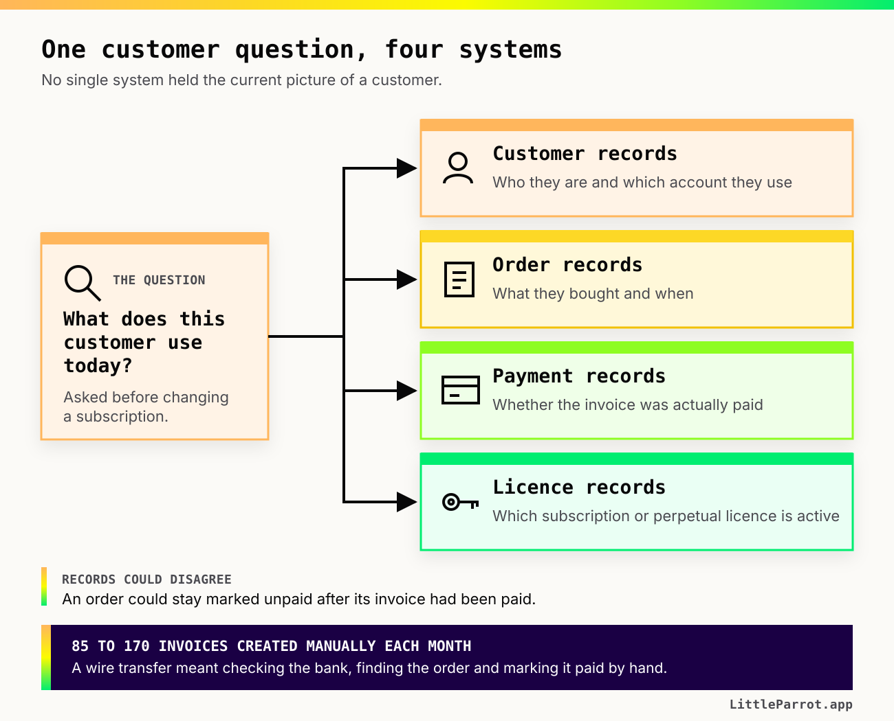

# Build versus buy software: what I learned from replacing an e-commerce platform

When I joined a mid-sized software company as a Product Manager, their attempt to implement an ERP (enterprise resource planning) had already failed.

The company sold SaaS and on-premises software. Some customers paid for subscriptions, while others bought perpetual licences. Behind the products was a messy combination of back-office systems and manual processes. I was asked to bring some order to those systems and the online checkout flow.

At first, replacing the e-commerce platform sounded like a software decision. Then I began speaking to the people who used the systems every day.

I interviewed 24 colleagues across Product, Engineering, Finance, Sales, Marketing, Support and Services. One number made the scale of the manual work very clear: the company created between 85 and 170 invoices manually each month. A wire-transfer order required someone to check the bank transaction, find the order, mark it as paid and trigger the customer email and licence.

Customer and purchase information was spread across several systems. In one process, a colleague had to check four different systems to understand what a customer used before changing their subscription. Records could disagree too: an order might remain marked as unpaid after the invoice had been paid, leaving someone to compare two reports and investigate it manually.



To be honest, the decision needed much more than a software comparison. It had to account for the existing data, the manual work and a business model that combined subscriptions with perpetual licences.

**Build versus buy software** is the decision whether a company should create and operate a software capability itself or purchase it from a vendor. We chose to build the parts where we needed control and integrate systems that still served us well.

We started by replacing the existing platform behind the online shop. We released small parts to production and directed live users to them, while the old and new systems ran together. For a while, our answer was deliberately hybrid. We continued until we could retire the old platform.

Buying software still leaves integration, migration, configuration, training and process changes to the company. Building software still involves external services, libraries and infrastructure. Most real options sit somewhere between the two.

So, I now compare the options against the same questions before recommending one.

## Start by defining the capability

The question _"Should we buy an ERP?"_ already assumes the shape of the answer.

So I began by describing the capabilities the company needed. In this case, the questions included:

- How should a customer buy a monthly or annual subscription through the checkout?
- How should the company record a perpetual licence and its maintenance or support entitlement?
- Which system should hold the current customer, order, payment and licence information when no unified customer record exists?
- What should happen when a customer upgrades, renews, cancels or asks for a correction?
- How can the product catalogue change without rebuilding the e-commerce platform each time the company introduces a new package?
- Which work should happen automatically, and which exceptions still need a person to review them?

Those questions describe behaviour and information. They let a vendor show whether its product supports the real use cases, and they give Engineering enough context to assess a custom build.

They also make a large programme easier to divide. A company may buy billing, build an entitlement service and connect both to an existing checkout. Or it may keep one manual review because automating a rare exception would cost more than the work it removes.

## The eight questions in my build versus buy decision framework

![The eight questions grouped into three stages. The capability is defined first, before any option is named. Fit and constraints: does this capability differentiate the product, which requirements cannot move, how will it fit the existing systems and data, and what must change outside the software. Owning it: who operates it after launch, and what each option will cost over three years. Risk and evidence: how difficult it is to change direction, and which evidence would change the recommendation. The recommendation is then written in words, with its reasoning, conditions, first scope, ownership and review signal.](./assets/build-vs-buy-eight-questions.svg)

### 1. Does this capability differentiate the product?

I ask how directly the capability affects why customers choose the product.

If it expresses a distinctive product experience or business model, the team may need more control over how it works and changes. If it is a standard supporting capability, a mature product may give the company what it needs without using months of engineering time.

Differentiation alone does not settle the choice. A vendor can support an important capability well, and a custom build can consume time without creating anything customers value. The question helps us decide how much control and flexibility the company needs.

### 2. Which requirements cannot move?

Every option looks reasonable while the requirements stay vague. I write down the conditions that would rule an option out.

For a company selling subscriptions and perpetual licences, these could include:

- the billing and licence models the system must support;
- countries, currencies, taxes and invoicing rules;
- security, privacy and audit requirements;
- customer and staff permissions;
- offline or on-premises activation needs;
- the exceptions that support and finance teams must handle.

Then I ask each vendor and each internal proposal to demonstrate those conditions. A _"yes, we support licences"_ is less useful than seeing the exact flow for issuing, renewing, transferring and revoking one.

### 3. How will it fit the existing systems and data?

This question was especially important in a business with several systems and manual hand-offs.

I want to know:

- Which system owns each important field today?
- Which system should own it after the change?
- How will orders, customers, payments and licences move between systems?
- Does the option provide the APIs, webhooks, exports and audit history we need?
- What happens when one update succeeds and another fails?
- How will we find and correct conflicting records?

A vendor product can be quick to configure and difficult to integrate. A custom service can fit the current systems and still create another source of truth that someone has to maintain. I ask Engineering to map the data flow for both options before comparing delivery dates.

If that map exposes major unknowns, I use a [technical feasibility assessment](/guides/technical-feasibility-product-managers) before asking for an estimate.

### 4. What must change outside the software?

A new system changes the work around it. Finance may reconcile payments in a different way. Sales may need to capture different information. Support may need new permissions and a way to correct an order. Customers may see a new checkout or account flow.

So I include process design, data preparation, migration, training and rollout in both options. Buying the licence does not complete any of those jobs.

I also ask who has the authority to change an existing process. Software can automate a defined process. It cannot settle an unresolved disagreement about which team owns a decision.

### 5. Who operates it after launch?

The first release is only one part of the cost.

For a build option, I ask who will:

- monitor it and respond when it fails;
- apply security updates;
- maintain integrations as other systems change;
- support finance, sales and customer-service colleagues;
- keep its documentation and test coverage current;
- prioritise future changes.

For a buy option, I ask who will:

- administer users, permissions and configuration;
- investigate problems before contacting the vendor;
- manage vendor releases and deprecated features;
- monitor usage and invoices;
- maintain the integrations and internal work around the product;
- own the vendor relationship and renewal.

The vendor owns its product. The company still owns the outcome its customers and colleagues experience.

### 6. What will each option cost under realistic scenarios?

I compare total cost over a useful period, rather than the build estimate with the first year's licence price.

A three-year comparison might include:

```text
Build cost = discovery and delivery
           + infrastructure and external services
           + security, monitoring and support
           + maintenance and future changes
           + migration and rollout

Buy cost   = licences or usage fees
           + procurement and implementation
           + configuration and integration
           + migration, training and support
           + vendor price increases and exit work
```

Then I calculate more than one scenario. What happens if transaction volume doubles? If the company adds another product? If a change needs vendor professional services? If the internal team needs another engineer to operate the custom system?

I do not expect these numbers to predict three years perfectly. I want the assumptions visible so Finance, Engineering and Product can challenge the same comparison.

### 7. How difficult is it to change direction?

I ask about reversibility before the company is committed.

For a vendor option:

- Can we export all our data in a documented format?
- Who owns custom configuration and integration code?
- How much notice do we receive for price or product changes?
- Can we run an alternative alongside it during a migration?
- What support does the vendor provide when we leave?

For a build option:

- Is the capability separated well enough to replace parts of it?
- Are the data model and interfaces documented?
- Does knowledge sit with several people or one person?
- Could a future team maintain it with the skills the company normally hires?

A cheaper option can become expensive when leaving requires a large migration under time pressure.

### 8. Which evidence would change the recommendation?

Before I present a recommendation, I write down the uncertainties that could reverse it.

Perhaps the vendor still needs to prove that it supports perpetual licences. Perhaps Engineering needs a short investigation into the existing checkout. Perhaps Finance needs to calculate the cost of today's manual reconciliation.

Each important unknown gets an owner and a date. If an answer could change the decision, I would rather say _"we need to verify this"_ than turn an assumption into a confident score.

## A weighted build versus buy decision table

I use a weighted table to keep the comparison consistent. Weight describes how important a criterion is for this decision. Rating describes how well an option meets it, based on the evidence available.

Use a scale of 1 to 5:

- **Weight:** 1 means useful; 5 means the option fails if this condition is not met.
- **Rating:** 1 means poor fit; 5 means strong fit.
- **Weighted score:** weight × rating.

Leave the rating as **unknown** when you do not have evidence. An empty cell is more honest than a number chosen to complete the table.

| Criterion | Question to answer | Weight | Build rating | Buy rating | Evidence or next step |
| --- | --- | --: | --: | --: | --- |
| Product differentiation | How much control does the product experience or business model require? | [1–5] | [1–5 or unknown] | [1–5 or unknown] | [Evidence] |
| Fixed requirements | Does the option support every condition that would rule it out? | [1–5] | [1–5 or unknown] | [1–5 or unknown] | [Demo, prototype or technical check] |
| Systems and data | How well does it integrate, and where will the source of truth sit? | [1–5] | [1–5 or unknown] | [1–5 or unknown] | [Data-flow map] |
| Migration and rollout | What data, process, training and customer changes are required? | [1–5] | [1–5 or unknown] | [1–5 or unknown] | [Migration assessment] |
| Time to a usable release | When can the company safely use the first valuable scope? | [1–5] | [1–5 or unknown] | [1–5 or unknown] | [Delivery evidence] |
| Operations and maintenance | Who supports, secures and changes it after launch? | [1–5] | [1–5 or unknown] | [1–5 or unknown] | [Named owner and capacity] |
| Total cost | What does each option cost across realistic three-year scenarios? | [1–5] | [1–5 or unknown] | [1–5 or unknown] | [Cost model] |
| Reversibility | How much work and data risk would changing direction create? | [1–5] | [1–5 or unknown] | [1–5 or unknown] | [Exit plan] |

Do the weighting with the decision-makers before showing them the option scores. Otherwise it is very easy to adjust the weights until the preferred answer wins.

And do not let the total make the decision for you. Two options can reach the same number for very different reasons. I use the table to expose disagreement, weak evidence and conditions, then write the recommendation in words.

## How the evidence changed our decision

The interviews gave us something more useful than a preference for building or buying. They showed where the current work failed, which systems still served us and where the company needed more control.

| What I found | The decision question it raised | How it affected the approach |
| --- | --- | --- |
| The company sold subscriptions and perpetual licences, and wanted to introduce more subscription tiers. | Could an external product support the current models and change with the product offering? | Flexibility became a condition of the decision, rather than a feature we could promise to handle later. |
| Customer, order, payment and licence information was spread across several systems. | Which system should own each record, and how would the others receive updates? | Replacing the visible online shop alone would leave the data problem in place. We needed explicit integration boundaries and a migration plan. |
| A colleague sometimes checked four systems to understand one customer's products and subscription. | Could either option give staff one reliable view without creating another conflicting customer record? | A unified customer identity became part of the architecture decision. |
| The company created between 85 and 170 invoices manually each month. | Which manual steps should disappear, and which exceptions still required a person? | We included operational work in the cost and scope instead of comparing software prices alone. |
| The existing e-commerce platform depended on an external vendor for changes. | How much control did the company need over checkout, account management and future product changes? | We decided to build the parts where that control was important and integrate existing systems that still worked well. |
| A complete replacement would touch live purchases, licences and internal work at the same time. | How could we change direction without placing the whole operation into one release? | We divided the replacement into small production releases and kept the old and new systems running together during the transition. |

Our decision was to build part of the system and integrate the existing systems we still needed. We first focused on replacing the external platform behind the e-commerce platform.

We isolated a part of the legacy system, reached the behaviour customers and colleagues already relied on, and deployed a small part to production. Then we directed live users to it and observed real orders before moving the next part.

For a while, the company had a hybrid solution. We used that period to find problems with live behaviour and infrastructure performance while the old route was still available. We continued step by step until we could retire the old platform.

![Three phases of replacing an e-commerce platform. Before: live customers reach a legacy platform whose changes depended on an external vendor, beside the existing back-office systems. During: real orders are sent to both routes, the parts of the legacy platform not replaced yet and the first parts of the new build in production, with the same back-office systems serving both. After: the legacy platform is retired, customers reach the new platform, and the existing systems are integrated at explicit boundaries rather than replaced.](./assets/ecommerce-platform-transition.svg)

That experience is why I include **first scope** and **exit conditions** in the decision. The recommendation needs to explain how the company can move safely, especially when the current system already supports live customers and back-office work.

## What the Product Manager owns in a build versus buy decision

The Product Manager makes the decision context usable:

- define the customer and business capability;
- describe the required behaviour and important exceptions;
- make constraints and assumptions visible;
- bring Product, Engineering, Finance, Security, Legal, Operations and the affected teams into the comparison;
- ensure both options are assessed against the same evidence;
- write the recommendation, its conditions and the next review point.

Engineering owns the technical assessment of the build and integration work. Finance and Procurement own the commercial checks. Security and Legal own their specialist assessments. The decision improves when those views meet in one comparison rather than arriving as separate approvals at the end.

I would summarise the recommendation like this:

```markdown
## Recommendation

[Build, buy or combine the options for this defined capability.]

## Why

[The evidence and trade-offs that support the recommendation.]

## Conditions

- [A condition that must remain true.]
- [An assumption that still needs verification.]

## First scope

[The smallest useful and safe release.]

## Ownership after launch

[Who operates, supports, secures and changes it.]

## Review or exit signal

[The event that should make us review the decision.]
```

## Build versus buy software pros and cons

If you need the short comparison, this is the version I use:

| Option | Can work well when | Costs or constraints to examine |
| --- | --- | --- |
| Build | The capability needs distinctive behaviour, close integration or frequent changes that the company must control. | Delivery time, engineering opportunity cost, security, operations, maintenance, support and concentration of knowledge. |
| Buy | The capability is well understood, vendors can prove the required fit and faster adoption is valuable. | Configuration, integration, migration, recurring fees, vendor limits, roadmap dependency, price changes and exit effort. |
| Combine | Standard components cover part of the capability while a smaller custom layer provides the product-specific behaviour. | Boundaries between systems, duplicated responsibility, data ownership and the maintenance of integration code. |

The better option depends on the capability, the company and the evidence available now. A previous failed purchase does not prove that the company should build everything. A slow internal project does not prove that buying will remove the hard work.

So, take one build versus buy decision your team is discussing and leave the option names off the page for ten minutes. Write down the capability, fixed requirements, data flow, operating owner and exit conditions first. Then ask whether the options you are comparing can actually meet them.

## Become a Technical Product Manager Without Becoming an Engineer

We're testing interest in an upcoming Little Parrot transformational learning path called [**Become a Technical Product Manager Without Becoming an Engineer**](/guides/technical-product-manager).

It's for software Product Managers who want to understand more deeply how their product works, investigate questions and contribute to scope and trade-off decisions with clearer evidence. The learning path isn't available yet. If you'd like us to tell you when it opens, [visit the landing page and register your interest](/guides/technical-product-manager).

### Editorial privacy note

- Keep the company, colleagues, products and internal system names anonymous.
- The figure of 85–170 manually created invoices per month is approved for publication.
- Exclude the tax-validation and legal record-keeping material from the source notes.

### Publishing notes

- Keep the weighted table as a real HTML table so readers can copy it and search systems can interpret its rows and columns.
- Use the three editable SVG diagrams in `assets/`. A PNG export sits beside each one as a preview and fallback.
- The alt text in the article names the four separate systems, the manual invoicing, the eight questions and their grouping, the incremental releases, the parallel operation and the retained-system integrations. Keep it if the diagrams change.
- The eight-questions diagram is the most likely one to be shared on its own. Give it a stable URL so other pages can link to it.
- Let readers open both diagrams full size on a phone. The card text is small at a 390px screen width.
- Add `Article` and `BreadcrumbList` structured data that matches the visible page.
- Show Kinga's author credentials, a published date and an updated date.
- Link back to the technical-feasibility article once both pages are live.
- Validate the learning-path landing page and interest form before publishing.
